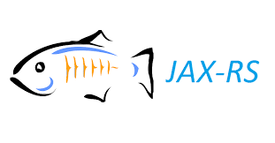

We currently support: **Java, C#, Python, Go, Dropwizard, gRPC, JAX-RS, Spring Boot, ASP.NET Core**

<a href="https://docs.wavefront.com/tracing_instrumenting_frameworks.html" target="_blank">See documentation for instrumentation <clr-icon shape="pop-out" /></a>