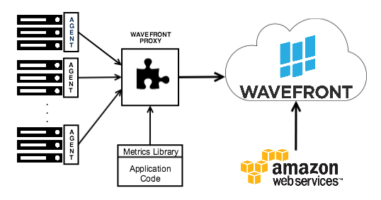
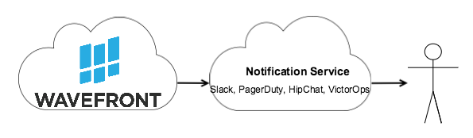
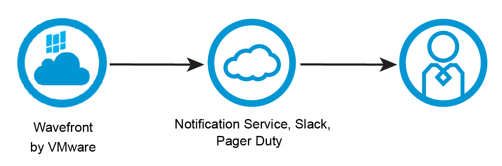

### What is an Integration?

Wavefront integrations are the link between any system and the Wavefront application. Integration links can be from your system into Wavefront or from Wavefront to an external system: data collector, alert notification, and authentication.

#### Data Collector and Code Instrumentation

Data collector integrations include all ways to get data into Wavefront: using a collector agent and Wavefront proxy, sending metrics from application code to the proxy, or Wavefront pulling the data from a cloud service.

####  Alert Notification

Alert notification integrations link alerts with incident management systems and notification services.

####  Authentication

Authentication integrations enable SSO access to Wavefront by linking to authentication providers. 

### What's Next

[Wavefront Integrations](https://docs.wavefront.com/wavefront_integrations.html)

