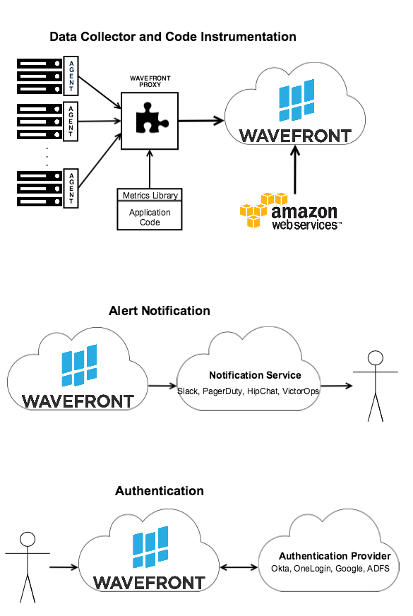

### What is an Integration?

Wavefront integrations are the link between any system and the Wavefront application. Integration links can be from your system into Wavefront or from Wavefront to an external system.

