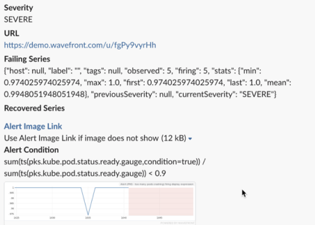

<strong>Intelligent alerting</strong> helps DevOps and developer teams avoid alert fatigue. Fine tune who receives the alert notification. You can pick how to send the alert based on severity.

&nbsp;

</img>

&nbsp;

<a href="../alerts/add"></img> </a>

When you get the alert notification, it includes a clickable link to the alert and an alert imagesnapshot, for example:

&nbsp;

&nbsp;

</img>
&nbsp;

