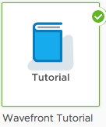

<table style="width: 100%;">
<tbody>
<tr>
<td width="70%">If you've got data flowing, add dashboards and customize with filters, functions, and grouping.</td>
<td width="30%"><a href="../dashboards/untitled-dashboard/create"></img> </a></td>
</tr>
<tr>
<td width="70%">To experiment with sample data, use our tutorial integration.
<td width="30%"><a href="../dashboard/tutorial-intro"></img> </a></td>
</tr>
<tr>
<td width="70%">Invite your co-workers to collaborate in Wavefront!</td>
<td width="30%">Enter email addresses separated by commas or spaces.
[[inviteUsers]]</td>
</tr>
</tbody>
</table>

