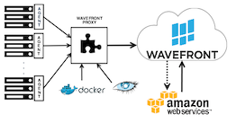

Welcome to Wavefront. Let's get you started.

First, have a look at how Wavefront works.

</img>

Wavefront makes it easy to stream your data into the Wavefront service. Depending on where the metrics originate, data is either pushed from agents and or pulled from cloud services.

An agent collects metrics and pushes it to the Wavefront proxy. The proxy runs within your infrastructure and forwards collected data to the Wavefront service. The proxy provides authentication, flow control metrics preprocessing, and more.

Wavefront directly pulls metrics data from cloud services such as Amazon Web Services (AWS). Wavefront offers CloudWatch, CloudTrail, and AWS Metrics+ cloud integrations.

 

<video width="100%" controls autoplay><source src="images/onboarding-welcome.mp4" type="video/mp4">Your browser does not support HTML5 video.</video>

  

