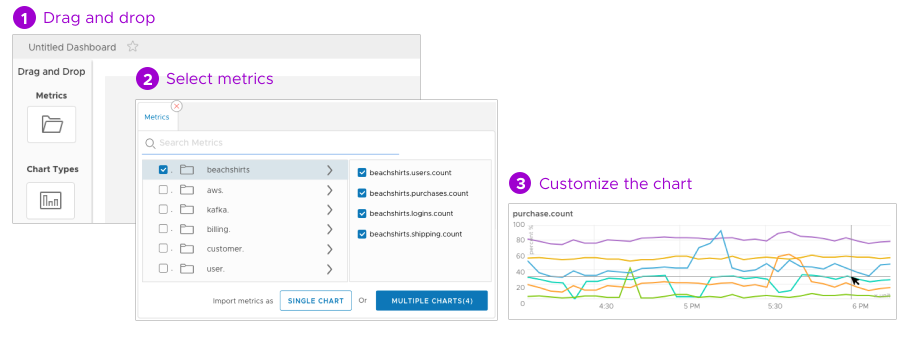

Examining your data in Wavefront charts and dashboards is as easy as 1&mdash;2&mdash;3.

&nbsp;

<a href="../dashboards/untitled-dashboard/create"><strong>Click here to create a dashboard!</strong> </a>

&nbsp;

&nbsp;

</img>
&nbsp;

