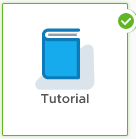

To experiment with sample data, use our <a href="../dashboard/tutorial-intro"><strong>tutorial integration</strong></a>.

<a href="../dashboard/tutorial-intro" aria-label="Tutorial integration"></img> </a>

&nbsp;

<strong>Invite your co-workers to collaborate!</strong>

Enter email addresses separated by commas or spaces.

[[inviteUsers]]

Want to learn about other features? Have questions?

<a href="https://docs.wavefront.com/tutorial_overview.html" aria-label="Tutorial and videos"></img></a>&nbsp; &nbsp;
<a href="https://vmwaoa.zendesk.com/hc/en-us/requests/new" aria-label="Get help"> </img></a>&nbsp; &nbsp;
 

